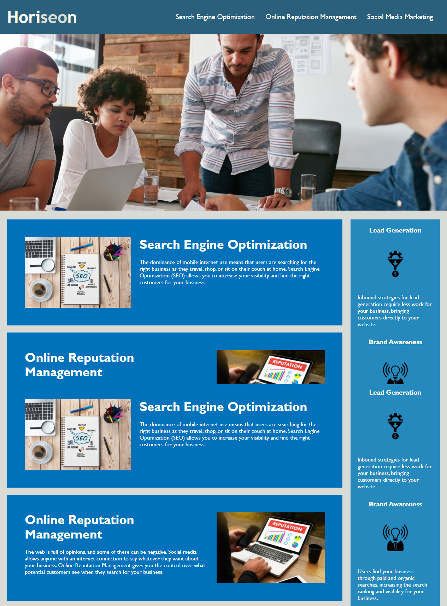

# horiseon-seo-project
SEO Site Optimization exercise

## Table of contents
- [Deployed Website](#deployedwebsite)
- [Description](#description)
- [Screenshots](#screenshots)
- [Tech/Framework](#tech/framework)
- [License](#license)

## Deployed Website

https://jessgreene9.github.io/horiseon-seo-project/

## Description
It is very important for businesses to ensure that their websites are easily accesibile for people with disabilites. Coders need to ensure that someone with assistive technology can still understand what images represent by adding alt atributes to the images in the code. 

Webpage source codes should be structured in a way that follows HTML semantic structure and are easy to read for any coder. This means that it is important to also consolidate CSS selectors and properties, organizing them in a way that follows the semantic structure of the HTML elements and includes comments to explain what is happening in each element or section. This also includes making comments on what what one has changed in the code. 

In refactoring this webpage, all links in the should function correctly. This makes the website more user-friendly and better for the business. In this webpage, the navigation bar was not originally working correctly. Now, when any link in the navigation bar is clicked, a user is brought to that correct section of the webpage.

## Screenshots

## Tech/Framework

VS Code

## License

